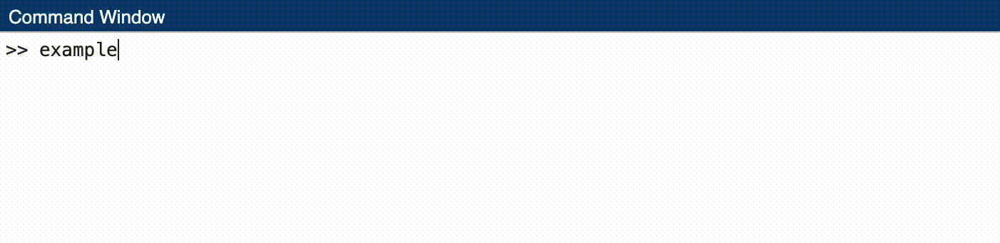

# MATLAB Progress Bar

Finally, a progress bar for MATLAB!



## Usage

Please ensure that the `progressbar.m` file is located within your MATLAB path. The following is an example demonstrating its usage:

```matlab
for i = 1:100
    progressbar(i, 100); % i is the current iteration, 100 is the total number of iterations
    pause(0.1); % pause can be replaced with your code
end
```

## Why Did I Write This?

I couldn't find a simple progress bar for MATLAB that I could integrate easily into my scripts, so I wrote one. It's simple, and it works.

Instead of waitbar, which blocks the MATLAB window, this progress bar is displayed in the command window, and it doesn't block the execution of the script.
